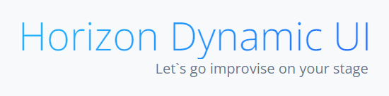

See the English version of the readme [here.](README.en-us.md)

# Horizon: Dynamic UI Framework


Horizon Dynamic UI — це мікрофреймворк JavaScript для створення динамічних, декларативних веб-інтерфейсів без потреби в бекенді чи інструментах збірки. Розроблений з урахуванням простоти розробника та архітектурної ясності, Horizon дозволяє налаштовувати сцени, макети та компоненти. Ви, немов би режисер — просто монтуйте, структуруйте та імпровізуйте на вашій власній сцені.

### Ключові характеристики:

⚙️ Без залежностей, без кроку збірки — працює безпосередньо в браузері

🧩 Декларативна композиція сцени: структура, макет, конфігурація

🚀 Легке розгортання на сторінках GitHub, Netlify або будь-якому статичному хості


## Але, чому саме він?

> Horizon Dynamic UI — це фреймворк, який змінює підхід до створення сайтів без бекенду. Він не потребує збірки, не нав'язує бібліотек, і працює прямо в браузері — з чистим HTML, CSS та JavaScript. Його сила — в простоті, масштабованості та душі.

---

### 🚀 1. Zero-Build Architecture

- **Ніякого білду** — жодного Webpack, Babel, Vite чи npm/yarn
- **Пряме виконання**: працює з будь-якого простого хостингу, з FTP, GitHub Pages, або локальної файлової системи

> Ви просто підключаєте `main.js` — і додаток запускається

---

### 🧩 2. Scene-Driven UI Composition

- У Horizon немає “App-компонента”
- Замість цього є **сцена**, яка описується через структуру, шаблон і конфігурацію
- Все монтується через `SceneManager.mountScene(sceneName)`

```js
LayoutRegistry = {
  personal_home: {
    structure: `<div id="intro"></div>`,
    layout: ["IntroBlock"],
    config: { IntroBlock: { title: "Welcome!" } }
  }
}
```

### 📦 3. Declarative Component Mounting

Цей спосіб дозволяє будувати сцени як компоненти, що мають чіткий інтерфейс:

- template — HTML-структура
- mount(config) — точка входу Такі сцени є повноцінними вузлами SceneManager'а, і можуть включатись у LayoutRegistry, переходити через Lifecycle, бути обробленими білдером або збереженими у компіляційний формат.

```javascript
import {renderTemplate} from "../core/helpers/renderTemplate.js";

export const WelcomeScene = {
  template: `
    <h1>{title}</h1>
    <p>{description}</p>
  `,
  mount(config = {}) {
    container.innerHTML = renderTemplate(this.template, config);
  }
}
```
Декларативний стиль обирається для сцен із логікою, повідомленнями, динамікою — тобто там, де шаблон служить інтерфейсом до конфігурації.

### 📦 4. Imperative Component Mounting

- Компоненти незалежні, без state-machine або lifecycle hooks
- Кожен компонент просто має `mount(params)` і знає, куди себе вставити
- Ніякої магії — тільки чиста логіка DOM

```javascript
export const WelcomeScene = {
  mount(config) {
    const container = document.getElementById("welcome-block");
    if (container) container.innerHTML = `
        <h1>{title}</h1>
        <p>{description}</p>
    `;
  }
};
```
Імперативний стиль рекомендований для статичних сцен із мінімальним HTML, як Page 404.

### 📘 5 Scene Lifecycle: `onMount()` у Horizon

У Horizon Dynamic UI сцена може реалізовувати метод `onMount(config)`,  
який викликається одразу після рендеру HTML.

```js
scene.onMount?.(config);
```

### Призначення

`onMount()` — це точка входу для логіки після побудови DOM. Вона дозволяє:

- Реєструвати події, обробники
- Ініціалізувати компонентні стани
- Виконувати асинхронну логіку
- Взаємодіяти з dispatcher'ом, manager'ами, router'ом

### Співіснування з обома стилями

| Стиль сцени       | Використання `onMount()`                | Характер     |
|-------------------|------------------------------------------|--------------|
| **Імперативний**  | Додаткова логіка, не обовʼязкова         | Простий      |
| **Декларативний** | Архітектурна точка входу до конфігурації | Системний    |

`onMount()` однаково доступний обом підходам, але його роль більш структурна в декларативному стилі. Сцена має право реалізовувати `onMount(config)`, незалежно від стилю шаблону. У декларативному підході цей хук є архітектурною точкою входу до логіки, в імперативному — простим доповненням.

### ✨ Рекомендація

У сценах з конфігурацією або інтерактивністю рекомендовано використовувати `onMount(config)` для ініціалізації логіки, подій, або доступу до середовищних API. У статичних сценах типу Page_404 метод може бути відсутнім або простим.


### 🔧 6. Свій маршрутизатор без залежностей

- Власний `useRouting()` — без зовнішніх router-бібліотек
- Прості маршрути через хеши (`#dashboard`, `#projects`, `#home`)
- Відсутність сцени автоматично веде до `page_404`

```javascript
routing.add("home", () => panelManager.mountScene("personal_home"));
```

### 7. Ідеальний для Hosting Anywhere

```
|                | Працює з |                          |
|     Хостинг    | Horizon? |         Коментар         |
|----------------|----------|--------------------------|
| GitHub Pages	 |    ✅    | Просто index.html + src/ |
| FTP-сервери	 |    ✅    | Без серверної частини    |
| Netlify	 |    ✅    | Миттєве розгортання       |
| Сервер із HTML |    ✅    | Ніяких node_modules       |
```
### 🎨 8. Розроблений для динамічних шаблонів

Horizon — не просто UI-бібліотека. Він створений, щоб перетворити статичний шаблон у динамічну сцену, без зміни його структури.

Ти створюєш structure, тобто HTML

Додаєш логіку через mount()

Результат — сайт виглядає як “живий”, навіть без API

### 9. Human-first Philosophy

> _Я створив Horizon: Dynamic UI Framework, бо хотів швидко розгортати динамічні шаблони без білду і складностей на тих платформах, які дозволяють робити тільки це_ — Євгеній, автор фреймворку

### 10. 🐞 Horizon Debugger Component

Базова реалізація екрану діагностики: 
- Виводить логі повідомлень (`console.warn`, `console.error`, `console.log`)
- Дозволяє бачити внутрішній стан застосунку у вигляді повідомлень
- Ініціалізується як частина `SceneManager` з можливістю підключення `DebugCatch` та `DebugView`

➡️ Подальші версії включатимуть інтерактивний лог, підказки з документації та динамічне трасування життєвого циклу сцен

### 11. Horizon UI — EntriesFlow

EntriesFlow — це логічна гілка Horizon UI для роботи з записами. Вона розширює ідеологію автономного інтерфейсу, де кожен компонент:

- функціонує в межах контрольованого сценарію
- реагує на зміни, але не втрачає свою незалежність
- враховує рівень доступу користувача
- є частиною BootSequence, тобто працює в узгодженому порядку

### Цілі
- Побудувати реактивну систему записів без фреймворків
- Тестувати компоненти в режимах view/edit/new
- Досліджувати синергію між BootSequence, Dispatcher, RenderPolicy і AccessLevel

### Компоненти
- `AddEntry`, `EditEntry`, `ShowEntry`, `EntriesList`, `EntryLayout`
- Логіка зберігання: `localStorage`
- Контексти: `SceneContext`, `entries.list`, `entries.editMode`

### Документація
- `RenderPolicy.md`: принципи життєздатності компонентів
- `FutureUpdatePlans.md`: стратегія, яка лежить попереду

---

### Для створення чого Horizon Dynamic UI можна використовувати?

- Портфоліо та інші сторінки на GitHub Pages
- Документаційні сайти
- Демо-версії UI для презентацій
- Внутрішні інтерфейси компаній
- Сайти з умовною динамікою (ілюзія бекенду)

### Архітектура фреймворку

```
project-root/
│
├── index.html             ← Головний entry-point для хостингу (GitHub Pages, Netlify)
├── src/                   ← Весь код фреймворку і сайту
│   ├── main.js            ← Ініціалізація Horizon (router, SceneManager)
│   ├── assets/            ← Зображення, стилі, шрифти
│   ├── components/        ← UI-модулі (TopBar, Footer, IntroBlock...)
│   ├── pages/             ← Сцени-представлення (personal_home, projects, contact...)
│   ├── router/            ← Роутинг (useRouting, route map)
│   └── core/              ← Ядро Horizon Dynamic UI
│       ├── composables/   ← Робота з даними, станом, маршрутом
│       │   ├── useDispatcher.js
│       │   ├── useLocalStorage.js
│       │   └── useRouting.js
│       └── tce/           ← Template Composition Engine (рендер сцени)
│           ├── SceneManager.js
│           └── RegistryLayoutScheme.js
```

### Коментарі до архітектури
```
| Частина            | Призначення                                                        |
|--------------------|--------------------------------------------------------------------|
| `core/composables` | Розширювані юзабіліті-хелпери для динаміки (дані, події, маршрути) |
| `core/tce`         | Рушій, що монтує сцени за Registry та SceneManager                 |
| `components`       | Презентаційні блоки інтерфейсу, із `mount(params)`                 |
| `pages`            | Конкретні сцени сайту, як `personal_home`, `projects`              |
| `router`           | Визначення маршруту та виклик сцен                                 |
| `main.js`          | Точка входу: ініціалізує рендер, роутер                            |
| `index.html`       | Зовнішній доступний документ — без білду, без Node.js              |

```

### Horizon UI створює сайт чи динамічний шаблон у 3 кроки

1. Створити шаблон сцени
2. Додати сцену у RegistryLayoutScheme.js та SceneManager.js
3. Додати маршрут у router

А далі можете вертіти, як завгодно: використовувати, як компоненти у самій сцені. Компонувати декілька компонентів для створення сцени безпосередньо з SceneManager.js. Передавати параметри. Додавати scoped стилі та скрипти, та використовувати ще багато-багато інших різноманітних фішок з наявних хелперів. Додавати свої, унікальні.

### Horizon Dynamic UI vs Vue vs React
```
| Критерій               | Horizon Dynamic UI                              | Vue                                   | React                                 |
|------------------------|--------------------------------------------------|----------------------------------------|----------------------------------------|
| ⚙️ Entry-point          | `main.js` → `SceneManager.mountScene()`          | `main.js` → `createApp(App)`          | `main.js` → `createRoot(...).render()` |
| 🧱 Головний шаблон      | `structure` в `RegistryLayoutScheme.js`          | `<App.vue>`                            | `<App.js>`                             |
| 🧩 Монтаж компонентів   | `mount(params)` + `layout[]` via `SceneManager` | `<Component />` в шаблоні              | `<Component />` в JSX                  |
| 🚏 Маршрутизація        | `useRouting()` + `routing.add(...)`             | `vue-router`                           | `react-router-dom`                     |
| 🧠 Архітектура          | Сцена → Layout → Компоненти                     | Компонентне дерево                     | Компонентне дерево                     |
| 🧮 Типізація параметрів | вручну або `paramTypes`                         | `props` + `defineProps()`              | `props` + PropTypes / TS               |
| 🌐 Рендер у DOM         | `document.getElementById(id)` → `innerHTML`     | `#app`                                 | `#root`                                |
| 🔧 Збірка/білд          | не потрібна (чистий JS)                         | потрібен білд                          | потрібен білд                          |
| 🚀 Хостинг              | GitHub Pages, FTP, будь-який простий сервер     | Vue CLI / Vite                         | Create React App / Vite                |
```

### Досвід розробки з Horizon Dynamic UI

> Horizon — це фреймворк, який мислить як розробник. Він не змушує тебе вивчати концепти, а дозволяє розуміти їх інтуїтивно. Створювати сайт на Horizon — як конфігурувати сцену, а не боротися з білдом або пропами.

---

### 🎯 Мета Horizon

- Зробити UI розробку **декларативною**, а не імперативною
- Дати можливість розгортати проєкти **без білду**
- Перетворити HTML шаблони на **живі сцени**
- Працювати прямо з браузером, без node_modules

---

### 🧠 Як відчувається Horizon для розробника

| Звична задача                | Horizon-підхід                            |
|-----------------------------|-------------------------------------------|
| Створити головну сторінку   | `SceneManager.mountScene("home")`        |
| Додати компонент             | `layout: ["TopBar", "IntroBlock"]`       |
| Передати дані               | `config: { IntroBlock: { bio: "..." } }` |
| Визначити маршрут           | `routing.add("home", () => mountScene(...))` |
| Підключити скрипт або стиль | `scriptSrc: [...]`, `linkHref: [...]`    |
| Описати структуру           | `structure: "<div id='main'></div>"`     |

> Ти більше не “пишеш JSX” — ти “описуєш сцену”

---

### ⚙️ Як Horizon спрощує життя

- Немає **jsx, props, state, lifecycle hooks**  
- Немає **webpack, babel, vite, npm**  
- Всі компоненти — прості об’єкти з `mount()`  
- Код читається як конфігурація, не як логіка  
- Проєкт запускається з `index.html` на будь-якому хостингу

---

### 🧩 “Компонент = поведінка + контейнер”

```js
export const TopBar = {
  mount(params) {
    const container = document.getElementById("navbar");
    if (container) container.innerHTML = `...`;
  }
};
```

Ти контролюєш DOM. Horizon — не абстракція, а прозора композиція.

### 📦 Відчуй себе архітектором

- Ти компонуєш UI за допомогою простого HTML
- Ти конфігуруєш проєкт та додаєш HTML динаміки
- Ти можеш лишити все так, без особливих налаштувань. Однак, твій шаблон все одно буде динамічним
  
### Працює скрізь

- Horizon Dynamic UI працює без сервера, без збірки, без node
- Ідеальний для:
    - GitHub Pages
    - Netlify
    - FTP 
    - Preview-сайтів
    - Прототипів UI

### У підсумку

Головна ідея фреймворку: _`сцени` — це макети_, а _`компоненти` — це поведінка_. Тож імпровізуй на своїй сцені!